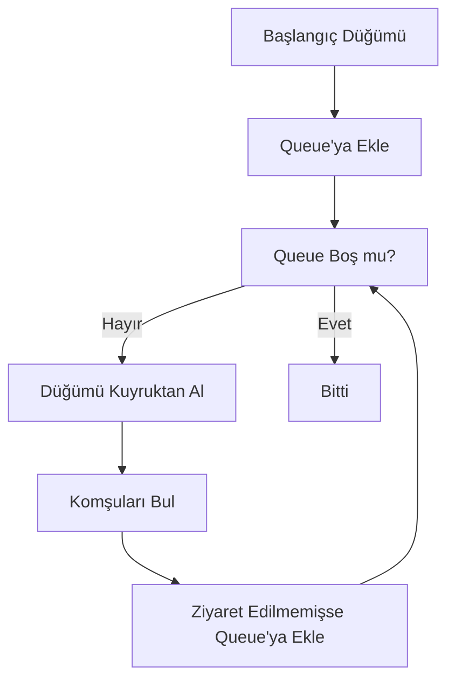
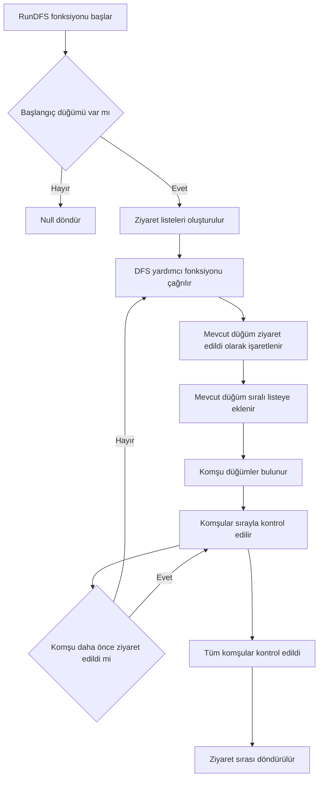
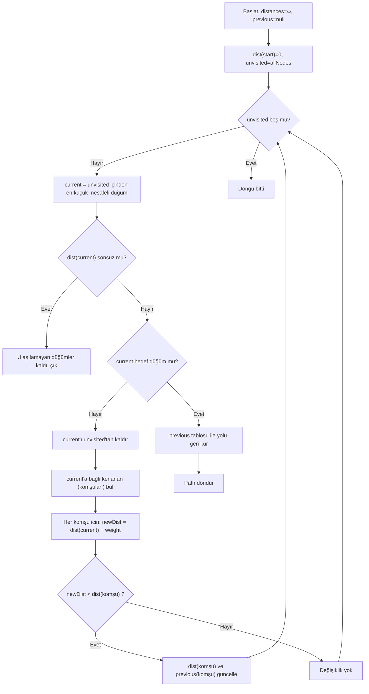
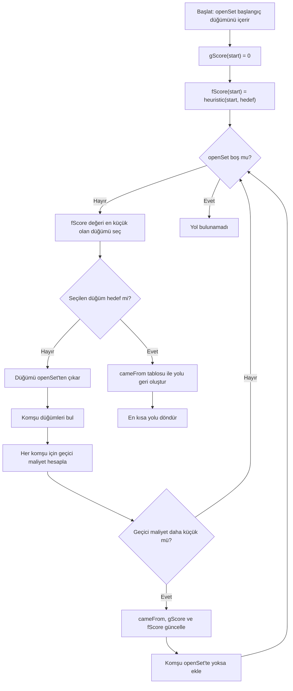
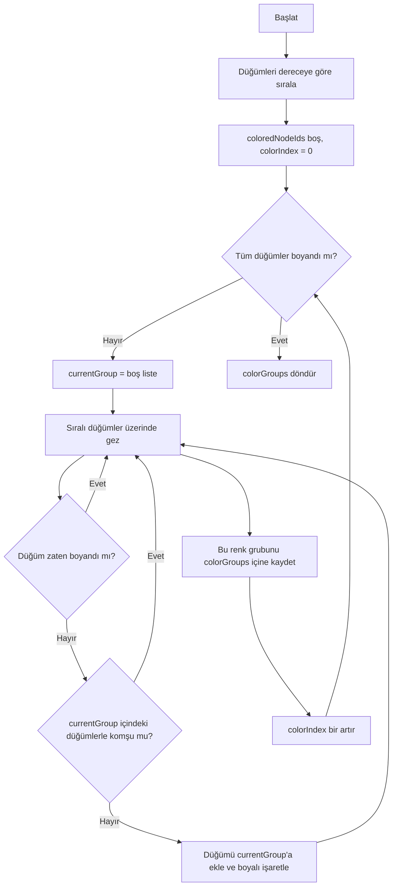
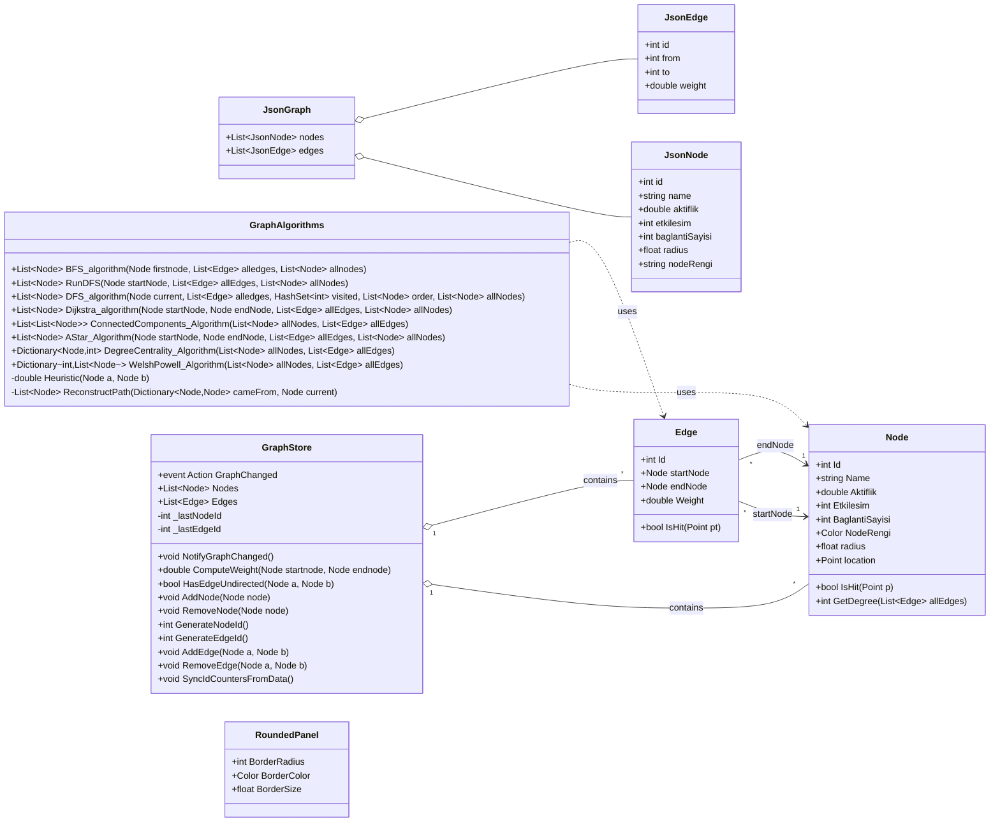
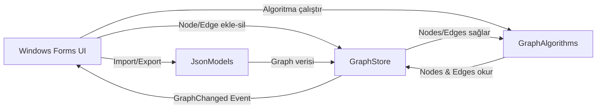

## 1. Proje Bilgileri
- Sosyal Ağ Analizi Uygulaması
- Alper Haklı: 231307056
- Rana Karagöl: 251307101 

## 2. Giriş
### Problemin Tanımı
Sosyal ağlardaki kullanıcılar arasındaki ilişkilerin analiz edilmesi, graf teorisi tabanlı algoritmaların uygulanmasını gerektirir.
Bu tür ağlarda bağlantı yapısı, etkileşim yoğunluğu ve en kısa yollar gibi metriklerin manuel olarak analiz edilmesi zordur.
### Amaç
Sosyal ağ yapısını graf veri yapısı ile modelleyerek, çeşitli graf algoritmalarını gerçekleştirmek ve bu algoritmaların sonuçlarını görsel bir arayüz üzerinden kullanıcıya sunmaktır.

## 3. Kullanılan Algoritmalar
Bu projede tüm algoritmalar 'yazlab_2_frontend/Algorithms/GraphAlgorithms.cs' sınıfı içerisinde yer almaktadır.

---

### 3.1 Breadth First Search (BFS)

**Amaç:** Başlangıç düğümünden itibaren grafı katman katman gezerek ziyaret sırasını elde etmek.

**Kullanılan fonksiyon:** `GraphAlgorithms.BFS_algorithm(Node firstnode, List<Edge> alledges, List<Node> allnodes)`

#### Çalışma Mantığı
- Bir `Queue<Node>` kullanılır.
- Başlangıç düğümü kuyruğa alınır ve `visited_ids` ile işaretlenir.
- Kuyruk boşalana kadar:
  - Kuyruğun başından düğüm alınır (dequeue) ve ziyaret listesine eklenir.
  - Tüm kenarlar taranır; current düğüme komşu düğüm bulunur.
  - Komşu daha önce ziyaret edilmediyse kuyruğa eklenir.

**Akış Diyagramı**

#### Karmaşıklık Analizi
Komşu bulma LINQ ile alledges tarandığı için:
- Zaman: O(V * E) 
- Alan: O(V)

#### Literatür
BFS algoritması, graf gezintisi ve ağırlıksız en kısa yol problemlerinde yaygın olarak kullanılmaktadır.

---

### 3.2 Depth First Search (DFS)
**Amaç**: Graf üzerinde bir düğümden başlayarak derinlemesine gezinti yapmak.

**Kullanılan fonksiyonlar:** 
- `RunDFS(Node startNode, List<Edge> allEdges, List<Node> allNodes)` 
- `DFS_algorithm(Node current, List<Edge> alledges, HashSet<int> visited_nodeids, List<Node> order, List<Node> allNodes)`

 --Her ikisinden birini seç

#### Çalışma Mantığı
DFS algoritması bu projede özyinelemeli (recursive) olarak gerçeklenmiştir. Stack veri yapısı yerine fonksiyon çağrı yığını kullanılmıştır.
visited_nodeids yapısı ile düğümlerin tekrar ziyaret edilmesi engellenir. Her düğüm ziyaret edildiğinde:
- Ziyaret listesine eklenir
- LINQ kullanılarak komşu düğümleri bulunur
- Ziyaret edilmemiş her komşu için DFS fonksiyonu tekrar çağrılır

**Akış Diyagramı**

**Karmaşıklık Analizi**
Komşular, her adımda kenar listesi taranarak bulunduğu için:
- Zaman Karmaşıklığı: O(V*E) 
- Alan Karmaşıklığı: O(V)

#### Literatür
DFS, graf üzerinde derinlemesine keşif yaparak bağlı bileşen bulma, çevrim (cycle) tespiti, topolojik sıralama ve yol arama gibi problemler için temel bir yöntemdir. Klasik uygulaması stack veya recursion ile yapılır.

---

### 3.3 Dijkstra Algoritması
**Amaç:** Ağırlıklı graf üzerinde iki düğüm arasındaki en kısa yolu bulmak.

**Çalışma Mantığı:** 
- Mesafeler Dictionary<Node,double> ile tutulur.
- En küçük mesafeye sahip düğüm seçilerek komşular güncellenir.
- Yol, previous tablosu kullanılarak geri oluşturulur.

**Akış Diyagramı**

#### Karmaşıklık
- Zaman Karmaşıklığı: O(V²)
- Alan Karmaşıklığı: O(V)

#### Literatür
Dijkstra, ağırlıkları negatif olmayan graflarda tek-kaynak en kısa yol problemine çözüm sunan klasik greedy algoritmadır. Uygulamada çoğunlukla öncelik kuyruğu ile hızlandırılır.

---

### 3.4 A* Algoritması
**Amaç:** A* algoritması, Dijkstra algoritmasına ek olarak sezgisel (heuristic) bir fonksiyon kullanarak hedef düğüme daha hızlı ulaşmayı amaçlar.
Bu projede Öklidyen mesafe heuristic olarak kullanılmıştır.

**Çalışma Mantığı**

**Akış Diyagramı**

#### Karmaşıklık
- Zaman Karmaşıklığı: O(V²)
- Alan Karmaşıklığı: O(V)

#### Literatür
A*, Dijkstra’nın optimalite garantisini koruyup buna ek olarak hedefe yönlendiren heuristik fonksiyonla arama maliyetini azaltmayı amaçlar. Uygun (admissible) heuristik seçildiğinde en kısa yolu bulur.

---

### 3.5 Welsh-Powell Algoritması
**Amaç:** Amaç, komşu düğümlerin aynı renge sahip olmamasını sağlayarak
grafı minimum renk sayısı ile boyamaktır.

**Çalışma Mantığı:**

**Akış Diyagramı**

#### Karmaşıklık
- Zaman Karmaşıklığı: O(V²E)
- Alan Karmaşıklığı: O(V)

#### Literatür
Welsh–Powell, greedy (açgözlü) yaklaşım ile graf renklendirme yapan klasik sezgisel bir algoritmadır. Amaç, komşu düğümlerin aynı rengi almamasını sağlayarak mümkün olduğunca az renk kullanmaktır. Optimal renk sayısını garanti etmez fakat pratikte hızlı ve uygulanabilir bir çözümdür.

---

## 4. Sınıf Yapısı ve Modüller
### 4.1 Genel Mimari 
Uygulama temel olarak aşağıdaki katmanlardan oluşmaktadır:

**Models:** 

Grafın temel veri yapılarının tanımlandığı katmandır.
Node ve Edge sınıfları bu katmanda yer almakta olup,
grafın düğüm ve kenar yapısını temsil eder.

**GraphStore:**

Graf verisinin merkezi olarak yönetildiği katmandır.
Düğüm ve kenar ekleme/silme işlemleri burada gerçekleştirilir.
Ayrıca grafik üzerinde yapılan değişiklikler, olay (event) tabanlı
bir yapı ile kullanıcı arayüzüne bildirilir.

**Algorithms:**

Graf üzerinde çalışan tüm algoritmaların toplandığı katmandır.
BFS, DFS, Dijkstra, A*, Welsh–Powell, bağlı bileşenler ve
derece merkeziliği algoritmaları bu katmanda gerçeklenmiştir.

**JsonModels:**

Graf verisinin JSON formatında içe ve dışa aktarılmasını sağlayan
veri modellerini içerir.

**Pages (UserControl Tabanlı UI Katmanı):**

Kullanıcı arayüzü, Windows Forms içerisinde Pages klasörü altında
oluşturulan UserControl bileşenleri ile tasarlanmıştır.
Uygulamadaki her sayfa, belirli bir işlevi temsil edecek şekilde
ayrı bir UserControl olarak geliştirilmiştir.

**CustomControls:**

Arayüzde tekrar kullanılabilir ve görsel olarak zenginleştirilmiş
özel bileşenlerin bulunduğu katmandır.

Bu mimari sayesinde arayüz, veri ve algoritma katmanları birbirinden
ayrılmış; bakım, test ve ileride yapılacak geliştirmeler
kolaylaştırılmıştır.

### 4.2 Sınıf Diyagramı

### 4.3 Sınıfların İşlev Açıklamaları
#### Node (Düğüm Modeli)
- Grafın temel bileşenidir ve sosyal ağdaki bir kullanıcıyı temsil eder.
- Aktiflik, Etkilesim ve BaglantiSayisi gibi sosyal ağ metriklerini içerir.
- GetDegree() metodu ile düğümün sahip olduğu bağlantı sayısı hesaplanır.
- IsHit() metodu, kullanıcı arayüzünde düğümün tıklanıp tıklanmadığını algılamak için kullanılır.

#### Edge (Kenar Modeli)
- İki Node arasındaki ilişkiyi temsil eder.
- Bu projede kenarlar yönsüz olarak ele alınmıştır;
startNode ve endNode alanları yalnızca bağlantının uçlarını belirtir.
- Weight alanı, iki düğüm arasındaki maliyeti veya benzerliği temsil eder.
- IsHit() metodu, arayüzde çizilen kenarın seçilip seçilmediğini tespit eder.

#### GraphStore (Merkezi Veri Deposu ve İş Kuralları)
- Grafın tek doğruluk kaynağı (Single Source of Truth) olarak görev yapar.
- Nodes ve Edges listeleri bu sınıf içerisinde tutulur.
- Düğüm ve kenar ekleme/silme işlemleri merkezi olarak yönetilir.
- AddEdge() fonksiyonu içerisinde:
  - Aynı kenarın tekrar eklenmesi engellenir (HasEdgeUndirected)
  - ComputeWeight() metodu ile kenar ağırlığı hesaplanır
  -Yalnızca etkilenen düğümlerin dereceleri güncellenerek performans açısından verimlilik sağlanır
- GraphChanged eventi sayesinde graf üzerindeki değişiklikler kullanıcı arayüzüne otomatik olarak bildirilir.

#### GraphAlgorithms (Algoritmalar Modülü)
- Graf üzerinde çalışan tüm algoritmalar bu sınıf altında toplanmıştır.
- BFS, DFS, Dijkstra, A*, bağlı bileşenler, derece merkeziliği ve Welsh–Powell algoritmaları bu sınıf içerisinde gerçeklenmiştir.
- Algoritmalar, Node ve Edge veri modellerini kullanarak çalışır.
- A* algoritmasında heuristic fonksiyon olarak Öklidyen mesafe tercih edilmiştir.

#### JsonModels (İçe / Dışa Aktarım Katmanı)
- Graf verisinin JSON formatında saklanması ve geri yüklenmesi için kullanılan veri modellerini içerir.
- JsonGraph, JsonNode ve JsonEdge sınıfları bu katmanda yer alır.
- JsonEdge sınıfında bağlantılar, from ve to alanları ile düğüm ID’leri üzerinden tanımlanır.
- Bu yapı, dosya tabanlı veri aktarımını ve veri tutarlılığını kolaylaştırır.

#### Pages (UserControl Tabanlı Arayüz Katmanı)
- Kullanıcı arayüzü, Pages klasörü altında geliştirilen UserControl bileşenleri ile oluşturulmuştur.
- Her UserControl, uygulamadaki belirli bir işlevi temsil eder (düğüm işlemleri, kenar işlemleri, algoritma çalıştırma, grafik görüntüleme vb.).
- Bu yaklaşım sayesinde:
  - Arayüz bileşenleri birbirinden bağımsız hale getirilmiştir
  - Kod tekrarının önüne geçilmiştir
  - Arayüz mantığı ile algoritma mantığı net biçimde ayrılmıştır
  -Tek bir ana Form üzerinden sayfa geçişleri yönetilebilmiştir

#### CustomControls (Özel Arayüz Bileşenleri)
- Kullanıcı arayüzünde tekrar kullanılabilir özel bileşenleri içerir.
- RoundedPanel sınıfı, panel bileşenlerine yuvarlatılmış köşeler kazandırmak amacıyla geliştirilmiştir.
- OnPaint() metodu ile özel çizim yapılmakta, DoubleBuffered özelliği sayesinde arayüzde oluşabilecek titreme (flickering) azaltılmaktadır.

### 4.4 Sistem Akış Diyagramı

## 5. Uygulama Açıklamaları
### Ekran Görüntüleri
### Test Senaryoları

## 6. Sonuç ve Tartışma
### Başarılar
### Sınırlılıklar
### Olası Geliştirmeler

