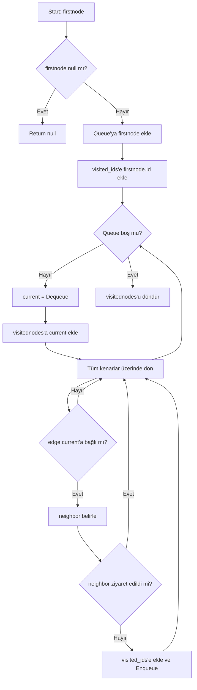

## 1. Proje Bilgileri
- Sosyal Ağ Analizi Uygulaması
- Alper Haklı: 231307056
- Rana Karagöl: 251307101 

## 2. Giriş
### Problemin Tanımı
### Amaç

## 3. Kullanılan Algoritmalar
Bu projede graf üzerinde gezinme, en kısa yol, bileşen bulma, merkezilik ve renklendirme işlemleri için aşağıdaki algoritmalar uygulanmıştır. Algoritmaların implementasyonları 'yazlab_2_frontend/Algorithms/GraphAlgorithms.cs' dosyasında yer almaktadır.

---

### 3.1 Breadth First Search (BFS)

**Amaç:** Başlangıç düğümünden itibaren grafı katman katman (level-order) gezerek ziyaret sırasını elde etmek.

**Kullanılan fonksiyon:** `GraphAlgorithms.BFS_algorithm(Node firstnode, List<Edge> alledges, List<Node> allnodes)`

#### Çalışma Mantığı
- Bir `Queue<Node>` kullanılır.
- Başlangıç düğümü kuyruğa alınır ve `visited_ids` ile işaretlenir.
- Kuyruk boşalana kadar:
  - Kuyruğun başından düğüm alınır (dequeue) ve ziyaret listesine eklenir.
  - Tüm kenarlar taranır; current düğüme komşu düğüm bulunur.
  - Komşu daha önce ziyaret edilmediyse kuyruğa eklenir.

```markdown
Akış Diyagramı


#### Karmaşıklık Analizi
Komşu bulma LINQ ile alledges tarandığı için:
- Zaman: O(V * E) (en kötü durum)
- Alan: O(V) (visited + recursion stack)

#### Literatür
DFS; bağlı bileşen, çevrim tespiti ve topolojik sıralama gibi birçok graf probleminde kullanılır.

---

### 3.2 Depth First Search (DFS)
**Amaç**: Graf üzerinde bir düğümden başlayarak olabildiğince derine inip geri dönerek tüm erişilebilir düğümleri ziyaret etmek.

**Kullanılan fonksiyonlar:** 
- `RunDFS(Node startNode, List<Edge> allEdges, List<Node> allNodes)` 
- `DFS_algorithm(Node current, List<Edge> alledges, HashSet<int> visited_nodeids, List<Node> order, List<Node> allNodes)`

 --Her ikisinden birini seç

#### Çalışma Mantığı
- DFS, özyinelemeli (recursive) olarak gerçeklenmiştir.
- visited_nodeids ile düğümlerin tekrar ziyaret edilmesi engellenir.
- Current düğüm:
  - Ziyaret listesine eklenir
  - LINQ kullanılarak komşuları bulunur
- Ziyaret edilmemiş her komşu için DFS fonksiyonu tekrar çağrılır.
- Stack yerine call stack (recursive çağrılar) kullanılır.

#### Çalışma Mantığı
- Stack yerine özyineleme (recursion) kullanılmıştır.
- visited_nodeids ile ziyaret kontrolü yapılır.
- Current düğümün komşuları LINQ ile bulunur:
  - Where ile current’a bağlı kenarlar seçilir.
  - Select ile current olmayan uç komşu olarak alınır.
- Ziyaret edilmemiş komşular için DFS recursive çağrılır.

```markdown
Akış Diyagramı

```mermaid
flowchart TD
    A["RunDFS(startNode)"] --> B{"startNode null mı?"}
    B -->|Evet| X["Return null"]
    B -->|Hayır| C["visitedIds ve visitedOrder oluştur"]
    C --> D["DFS_algorithm(startNode)"]
    D --> Z["visitedOrder'ı döndür"]

    subgraph DFS_algorithm(current)
        E["current.Id visitedIds'e ekle"]
        F["current'ı order'a ekle"]
        G["Komşuları LINQ ile bul"]
        H{"Komşu ziyaret edildi mi?"}
        I["DFS_algorithm(komşu)"]

        E --> F --> G --> H
        H -->|Hayır| I --> G
        H -->|Evet| G
    end
```
#### Karmaşıklık Analizi
Komşular, her adımda kenar listesi taranarak bulunduğu için:
- Zaman Karmaşıklığı: O(V*E) (en kötü durum)
- Alan Karmaşıklığı: O(V)

#### Literatür
DFS; bağlı bileşen, çevrim tespiti ve topolojik sıralama gibi birçok graf probleminde kullanılır.

---

### 3.3 Dijkstra Algoritması


### 3.4 A* Algoritması

### 3.5 Welsh-Powell Algoritması

## 4. Sınıf Yapısı ve Modüller

## 5. Uygulama Açıklamaları
### Ekran Görüntüleri
### Test Senaryoları

## 6. Sonuç ve Tartışma
### Başarılar
### Sınırlılıklar
### Olası Geliştirmeler


