```mermaid
flowchart TD
    A["Başlat: distances=∞, previous=null"] --> B["dist(start)=0, unvisited=allNodes"]
    B --> C{"unvisited boş mu?"}
    C -->|Hayır| D["current = unvisited içinden en küçük mesafeli düğüm"]
    D --> E{"dist(current) sonsuz mu?"}
    E -->|Evet| X["Ulaşılamayan düğümler kaldı, çık"]
    E -->|Hayır| F{"current hedef düğüm mü?"}
    F -->|Evet| G["previous tablosu ile yolu geri kur"]
    F -->|Hayır| H["current'ı unvisited'tan kaldır"]
    H --> I["current'a bağlı kenarları (komşuları) bul"]
    I --> J["Her komşu için: newDist = dist(current) + weight"]
    J --> K{"newDist < dist(komşu) ?"}
    K -->|Evet| L["dist(komşu) ve previous(komşu) güncelle"]
    K -->|Hayır| M["Değişiklik yok"]
    L --> C
    M --> C
    C -->|Evet| N["Döngü bitti"]
    G --> P["Path döndür"]
```

```mermaid
flowchart TD
    A["Başlat: openSet başlangıç düğümünü içerir"] --> B["gScore(start) = 0"]
    B --> C["fScore(start) = heuristic(start, hedef)"]
    C --> D{"openSet boş mu?"}
    D -->|Hayır| E["fScore değeri en küçük olan düğümü seç"]
    E --> F{"Seçilen düğüm hedef mi?"}
    F -->|Evet| G["cameFrom tablosu ile yolu geri oluştur"]
    F -->|Hayır| H["Düğümü openSet'ten çıkar"]
    H --> I["Komşu düğümleri bul"]
    I --> J["Her komşu için geçici maliyet hesapla"]
    J --> K{"Geçici maliyet daha küçük mü?"}
    K -->|Evet| L["cameFrom, gScore ve fScore güncelle"]
    L --> M["Komşu openSet'te yoksa ekle"]
    M --> D
    K -->|Hayır| D
    D -->|Evet| Z["Yol bulunamadı"]
    G --> P["En kısa yolu döndür"]
```

```mermaid
flowchart TD
    A["Başlat"] --> B["Düğümleri dereceye göre sırala"]
    B --> C["coloredNodeIds boş, colorIndex = 0"]
    C --> D{"Tüm düğümler boyandı mı?"}

    D -->|Hayır| E["currentGroup = boş liste"]
    E --> F["Sıralı düğümler üzerinde gez"]
    F --> G{"Düğüm zaten boyandı mı?"}
    G -->|Evet| F

    G -->|Hayır| H{"currentGroup içindeki düğümlerle komşu mu?"}
    H -->|Hayır| I["Düğümü currentGroup'a ekle ve boyalı işaretle"]
    I --> F
    H -->|Evet| F

    F --> J["Bu renk grubunu colorGroups içine kaydet"]
    J --> K["colorIndex bir artır"]
    K --> D

    D -->|Evet| L["colorGroups döndür"]

```

## 1. Proje Bilgileri
- Sosyal Ağ Analizi Uygulaması
- Alper Haklı: 231307056
- Rana Karagöl: 251307101 

## 2. Giriş
### Problemin Tanımı
Sosyal ağlardaki kullanıcılar arasındaki ilişkilerin analiz edilmesi, graf teorisi tabanlı algoritmaların uygulanmasını gerektirir.
Bu tür ağlarda bağlantı yapısı, etkileşim yoğunluğu ve en kısa yollar gibi metriklerin manuel olarak analiz edilmesi zordur.
### Amaç
Sosyal ağ yapısını graf veri yapısı ile modelleyerek, çeşitli graf algoritmalarını gerçekleştirmek ve bu algoritmaların sonuçlarını görsel bir arayüz üzerinden kullanıcıya sunmaktır.

## 3. Kullanılan Algoritmalar
Bu projede tüm algoritmalar 'yazlab_2_frontend/Algorithms/GraphAlgorithms.cs' sınıfı içerisinde yer almaktadır.

---

### 3.1 Breadth First Search (BFS)

**Amaç:** Başlangıç düğümünden itibaren grafı katman katman gezerek ziyaret sırasını elde etmek.

**Kullanılan fonksiyon:** `GraphAlgorithms.BFS_algorithm(Node firstnode, List<Edge> alledges, List<Node> allnodes)`

#### Çalışma Mantığı
- Bir `Queue<Node>` kullanılır.
- Başlangıç düğümü kuyruğa alınır ve `visited_ids` ile işaretlenir.
- Kuyruk boşalana kadar:
  - Kuyruğun başından düğüm alınır (dequeue) ve ziyaret listesine eklenir.
  - Tüm kenarlar taranır; current düğüme komşu düğüm bulunur.
  - Komşu daha önce ziyaret edilmediyse kuyruğa eklenir.

**Akış Diyagramı**

```mermaid
flowchart TD
    A[Başlangıç Düğümü] --> B[Queue'ya Ekle]
    B --> C[Queue Boş mu?]
    C -->|Hayır| D[Düğümü Kuyruktan Al]
    D --> E[Komşuları Bul]
    E --> F[Ziyaret Edilmemişse Queue'ya Ekle]
    F --> C
    C -->|Evet| G[Bitti]
```

#### Karmaşıklık Analizi
Komşu bulma LINQ ile alledges tarandığı için:
- Zaman: O(V * E) 
- Alan: O(V)

#### Literatür
BFS algoritması, graf gezintisi ve ağırlıksız en kısa yol problemlerinde yaygın olarak kullanılmaktadır.

---

### 3.2 Depth First Search (DFS)
**Amaç**: Graf üzerinde bir düğümden başlayarak derinlemesine gezinti yapmak.

**Kullanılan fonksiyonlar:** 
- `RunDFS(Node startNode, List<Edge> allEdges, List<Node> allNodes)` 
- `DFS_algorithm(Node current, List<Edge> alledges, HashSet<int> visited_nodeids, List<Node> order, List<Node> allNodes)`

 --Her ikisinden birini seç

#### Çalışma Mantığı
DFS algoritması bu projede özyinelemeli (recursive) olarak gerçeklenmiştir. Stack veri yapısı yerine fonksiyon çağrı yığını kullanılmıştır.
visited_nodeids yapısı ile düğümlerin tekrar ziyaret edilmesi engellenir. Her düğüm ziyaret edildiğinde:
- Ziyaret listesine eklenir
- LINQ kullanılarak komşu düğümleri bulunur
- Ziyaret edilmemiş her komşu için DFS fonksiyonu tekrar çağrılır

**Akış Diyagramı**

```mermaid
flowchart TD
    A["RunDFS fonksiyonu başlar"] --> B{"Başlangıç düğümü var mı"}
    B -->|Hayır| Z["Null döndür"]
    B -->|Evet| C["Ziyaret listeleri oluşturulur"]
    C --> D["DFS yardımcı fonksiyonu çağrılır"]
    D --> E["Mevcut düğüm ziyaret edildi olarak işaretlenir"]
    E --> F["Mevcut düğüm sıralı listeye eklenir"]
    F --> G["Komşu düğümler bulunur"]
    G --> H["Komşular sırayla kontrol edilir"]
    H --> I{"Komşu daha önce ziyaret edildi mi"}
    I -->|Hayır| D
    I -->|Evet| H
    H --> J["Tüm komşular kontrol edildi"]
    J --> K["Ziyaret sırası döndürülür"]

```

**Karmaşıklık Analizi**
Komşular, her adımda kenar listesi taranarak bulunduğu için:
- Zaman Karmaşıklığı: O(V*E) 
- Alan Karmaşıklığı: O(V)

#### Literatür
DFS, graf üzerinde derinlemesine keşif yaparak bağlı bileşen bulma, çevrim (cycle) tespiti, topolojik sıralama ve yol arama gibi problemler için temel bir yöntemdir. Klasik uygulaması stack veya recursion ile yapılır.

---

### 3.3 Dijkstra Algoritması
**Amaç:** Ağırlıklı graf üzerinde iki düğüm arasındaki en kısa yolu bulmak.

**Çalışma Mantığı:** 
- Mesafeler Dictionary<Node,double> ile tutulur.
- En küçük mesafeye sahip düğüm seçilerek komşular güncellenir.
- Yol, previous tablosu kullanılarak geri oluşturulur.

**Akış Diyagramı**

#### Karmaşıklık
- Zaman Karmaşıklığı: O(V²)
- Alan Karmaşıklığı: O(V)

#### Literatür
Dijkstra, ağırlıkları negatif olmayan graflarda tek-kaynak en kısa yol problemine çözüm sunan klasik greedy algoritmadır. Uygulamada çoğunlukla öncelik kuyruğu ile hızlandırılır.

---

### 3.4 A* Algoritması
**Amaç:** A* algoritması, Dijkstra algoritmasına ek olarak sezgisel (heuristic) bir fonksiyon kullanarak hedef düğüme daha hızlı ulaşmayı amaçlar.
Bu projede Öklidyen mesafe heuristic olarak kullanılmıştır.

**Çalışma Mantığı**

**Akış Diyagramı**

#### Karmaşıklık
- Zaman Karmaşıklığı: O(V²)
- Alan Karmaşıklığı: O(V)

#### Literatür
A*, Dijkstra’nın optimalite garantisini koruyup buna ek olarak hedefe yönlendiren heuristik fonksiyonla arama maliyetini azaltmayı amaçlar. Uygun (admissible) heuristik seçildiğinde en kısa yolu bulur.

---

### 3.5 Welsh-Powell Algoritması
**Amaç:** Amaç, komşu düğümlerin aynı renge sahip olmamasını sağlayarak
grafı minimum renk sayısı ile boyamaktır.

**Çalışma Mantığı:**

**Akış Diyagramı**

#### Karmaşıklık
- Zaman Karmaşıklığı: O(V²E)
- Alan Karmaşıklığı: O(V)

#### Literatür
Welsh–Powell, greedy (açgözlü) yaklaşım ile graf renklendirme yapan klasik sezgisel bir algoritmadır. Amaç, komşu düğümlerin aynı rengi almamasını sağlayarak mümkün olduğunca az renk kullanmaktır. Optimal renk sayısını garanti etmez fakat pratikte hızlı ve uygulanabilir bir çözümdür.

---

## 4. Sınıf Yapısı ve Modüller
### 4.1 Genel Mimari 
Uygulama temel olarak aşağıdaki katmanlardan oluşmaktadır:

**Models:** 

Grafın temel veri yapılarının tanımlandığı katmandır.
Node ve Edge sınıfları bu katmanda yer almakta olup,
grafın düğüm ve kenar yapısını temsil eder.

**GraphStore:**

Graf verisinin merkezi olarak yönetildiği katmandır.
Düğüm ve kenar ekleme/silme işlemleri burada gerçekleştirilir.
Ayrıca grafik üzerinde yapılan değişiklikler, olay (event) tabanlı
bir yapı ile kullanıcı arayüzüne bildirilir.

**Algorithms:**

Graf üzerinde çalışan tüm algoritmaların toplandığı katmandır.
BFS, DFS, Dijkstra, A*, Welsh–Powell, bağlı bileşenler ve
derece merkeziliği algoritmaları bu katmanda gerçeklenmiştir.

**JsonModels:**

Graf verisinin JSON formatında içe ve dışa aktarılmasını sağlayan
veri modellerini içerir.

**Pages (UserControl Tabanlı UI Katmanı):**

Kullanıcı arayüzü, Windows Forms içerisinde Pages klasörü altında
oluşturulan UserControl bileşenleri ile tasarlanmıştır.
Uygulamadaki her sayfa, belirli bir işlevi temsil edecek şekilde
ayrı bir UserControl olarak geliştirilmiştir.

**CustomControls:**

Arayüzde tekrar kullanılabilir ve görsel olarak zenginleştirilmiş
özel bileşenlerin bulunduğu katmandır.

Bu mimari sayesinde arayüz, veri ve algoritma katmanları birbirinden
ayrılmış; bakım, test ve ileride yapılacak geliştirmeler
kolaylaştırılmıştır.

### 4.2 Sınıf Diyagramı

### 4.3 Sınıfların İşlev Açıklamaları
#### Node (Düğüm Modeli)
- Grafın temel bileşenidir ve sosyal ağdaki bir kullanıcıyı temsil eder.
- Aktiflik, Etkilesim ve BaglantiSayisi gibi sosyal ağ metriklerini içerir.
- GetDegree() metodu ile düğümün sahip olduğu bağlantı sayısı hesaplanır.
- IsHit() metodu, kullanıcı arayüzünde düğümün tıklanıp tıklanmadığını algılamak için kullanılır.

#### Edge (Kenar Modeli)
- İki Node arasındaki ilişkiyi temsil eder.
- Bu projede kenarlar yönsüz olarak ele alınmıştır;
startNode ve endNode alanları yalnızca bağlantının uçlarını belirtir.
- Weight alanı, iki düğüm arasındaki maliyeti veya benzerliği temsil eder.
- IsHit() metodu, arayüzde çizilen kenarın seçilip seçilmediğini tespit eder.

#### GraphStore (Merkezi Veri Deposu ve İş Kuralları)
- Grafın tek doğruluk kaynağı (Single Source of Truth) olarak görev yapar.
- Nodes ve Edges listeleri bu sınıf içerisinde tutulur.
- Düğüm ve kenar ekleme/silme işlemleri merkezi olarak yönetilir.
- AddEdge() fonksiyonu içerisinde:
  - Aynı kenarın tekrar eklenmesi engellenir (HasEdgeUndirected)
  - ComputeWeight() metodu ile kenar ağırlığı hesaplanır
  -Yalnızca etkilenen düğümlerin dereceleri güncellenerek performans açısından verimlilik sağlanır
- GraphChanged eventi sayesinde graf üzerindeki değişiklikler kullanıcı arayüzüne otomatik olarak bildirilir.

#### GraphAlgorithms (Algoritmalar Modülü)
- Graf üzerinde çalışan tüm algoritmalar bu sınıf altında toplanmıştır.
- BFS, DFS, Dijkstra, A*, bağlı bileşenler, derece merkeziliği ve Welsh–Powell algoritmaları bu sınıf içerisinde gerçeklenmiştir.
- Algoritmalar, Node ve Edge veri modellerini kullanarak çalışır.
- A* algoritmasında heuristic fonksiyon olarak Öklidyen mesafe tercih edilmiştir.

#### JsonModels (İçe / Dışa Aktarım Katmanı)
- Graf verisinin JSON formatında saklanması ve geri yüklenmesi için kullanılan veri modellerini içerir.
- JsonGraph, JsonNode ve JsonEdge sınıfları bu katmanda yer alır.
- JsonEdge sınıfında bağlantılar, from ve to alanları ile düğüm ID’leri üzerinden tanımlanır.
- Bu yapı, dosya tabanlı veri aktarımını ve veri tutarlılığını kolaylaştırır.

#### Pages (UserControl Tabanlı Arayüz Katmanı)
- Kullanıcı arayüzü, Pages klasörü altında geliştirilen UserControl bileşenleri ile oluşturulmuştur.
- Her UserControl, uygulamadaki belirli bir işlevi temsil eder (düğüm işlemleri, kenar işlemleri, algoritma çalıştırma, grafik görüntüleme vb.).
- Bu yaklaşım sayesinde:
  - Arayüz bileşenleri birbirinden bağımsız hale getirilmiştir
  - Kod tekrarının önüne geçilmiştir
  - Arayüz mantığı ile algoritma mantığı net biçimde ayrılmıştır
  -Tek bir ana Form üzerinden sayfa geçişleri yönetilebilmiştir

#### CustomControls (Özel Arayüz Bileşenleri)
- Kullanıcı arayüzünde tekrar kullanılabilir özel bileşenleri içerir.
- RoundedPanel sınıfı, panel bileşenlerine yuvarlatılmış köşeler kazandırmak amacıyla geliştirilmiştir.
- OnPaint() metodu ile özel çizim yapılmakta, DoubleBuffered özelliği sayesinde arayüzde oluşabilecek titreme (flickering) azaltılmaktadır.

### 4.4 Sistem Akış Diyagramı

```mermaid
flowchart LR
UI[Windows Forms UI] -->|Node/Edge ekle-sil| GS[GraphStore]
GS -->|GraphChanged Event| UI
UI -->|Algoritma çalıştır| GA[GraphAlgorithms]
GA -->|Nodes & Edges okur| GS
GS -->|Nodes/Edges sağlar| GA
UI -->|Import/Export| JM[JsonModels]
JM -->|Graph verisi| GS
```

## 5. Uygulama Açıklamaları
## Ekran Görüntüleri
 ---
### Ana Ekran

---
### Düğüm Ekranı

---
### Grafik Ekranı

---
### İçe/Dışa Aktar Ekranı

---
### İstatistikler Ekranı

---

## 🧪 Test Senaryoları

Uygulamanın kararlılığını ve doğruluğunu sağlamak için aşağıdaki test senaryoları uyguladık.
---
### 1. Graf Oluşturma ve Düzenleme Testleri

| Test No | Senaryo Adı | Yapılan İşlem | Beklenen Sonuç |
| :--- | :--- | :--- | :--- |
| **T-01** | Düğüm  Ekleme | "Düğüm Modu"nda boş alana sol tıklanır. | Tıklanan koordinatta varsayılan yarıçapta yeni bir düğüm oluşmalı. |
| **T-02** | Kenar  Çizme | "Kenar Modu"nda bir düğümden diğerine sürükle-bırak yapılır. | İki düğüm arasında gri bir çizgi (bağlantı) oluşmalı. |
| **T-03** | Düğüm Taşıma | Var olan bir düğüm tutulup sürüklenir. | Düğüm yeni konuma gelmeli ve ona bağlı olan kenarlar kopmadan takip etmeli. |
| **T-04** | Düğüm Özelleştirme  | Bir düğüm seçilir ve sağdaki menüden özellikleri değiştirilebilir | Renk paleti açılmalı, seçilen renk düğüme anlık olarak uygulanmalı. |
| **T-05** | Yarıçap Değiştirme | Düğüm seçilip TextBox'a sayı girilir. | Seçili düğümün boyutu girilen değere göre büyümeli/küçülmeli. |
---
### 2. Yol Bulma Algoritmaları

| Test No | Senaryo Adı | Yapılan İşlem | Beklenen Sonuç |
| :--- | :--- | :--- | :--- |
| **T-06** | BFS Çalıştırma | Başlangıç düğümü seçilir, BFS algoritması çalıştırılır. | Düğümden başlayarak **dalga dalga (katman katman)** yayılmalı ve ziyaret sırasına göre sarı/yeşil animasyon oynamalı. |
| **T-07** | DFS Çalıştırma | Başlangıç düğümü seçilir, DFS algoritması çalıştırılır. | Algoritma bir daldan **en uca kadar** gitmeli, sonra geri dönüp (backtrack) diğer dala girmeli. |
| **T-08** | Dijkstra En Kısa Yol | Başlangıç ve Bitiş seçilir, Dijkstra çalıştırılır. | İki düğüm arasındaki **toplam ağırlığı en düşük** olan yol çizilmeli. Maliyet (Cost) doğru hesaplanmalı. |
| **T-09** | A* (A-Star) Performansı | Başlangıç ve Bitiş seçilir, A* çalıştırılır. | Dijkstra ile aynı yolu bulmalı ancak hedef odaklı olduğu için (Heuristic) **daha az düğümü ziyaret ederek** sonuca ulaşmalı. |
| **T-10** | Hedefsiz Yol Arama | Dijkstra/A* seçilir ama Hedef (Target) seçilmez. | Ekrana "Lütfen bir hedef düğüm seçiniz" uyarısı gelmeli, program çökmemeli. |
---
### 3. Analiz Algoritmaları

| Test No | Senaryo Adı | Yapılan İşlem | Beklenen Sonuç |
| :--- | :--- | :--- | :--- |
| **T-11** | Bağlı Bileşenler | Birbirinden kopuk 2-3 ayrı grup çizilir ve algoritma çalıştırılır. | Her bağımsız grup **farklı bir renge** boyanmalı. Log ekranında grup sayısı yazmalı. |
| **T-12** | Derece Merkeziliği | Merkezilik algoritması çalıştırılır. | Çok bağlantısı olan düğümler **daha büyük** ve **açık renk**, az bağlantısı olanlar küçük çizilmeli. |
| **T-13** | Welsh-Powell | Renklendirme algoritması çalıştırılır. | Birbiriyle komşu olan hiçbir düğüm **aynı renkte olmamalı**. Kromatik sayı yani toplam renk sayısı mesaj olarak gösterilmeli. |
---
### 4. İstatistik ve Raporlama (Data & Logs)

| Test No | Senaryo Adı | Yapılan İşlem | Beklenen Sonuç |
| :--- | :--- | :--- | :--- |
| **T-14** | Canlı İstatistik Güncelleme | Ana sayfada yeni düğüm eklenir, "İstatistikler" sekmesine geçilir. | Düğüm sayısı, Kenar sayısı ve Yoğunluk değerleri **otomatik olarak artmış** şekilde görünmeli. |
| **T-15** | Loglama Sistemi | Bir algoritma çalıştırılır ve biter. | Log panelinde `[Tarih/Saat] [Algoritma Adı] İşlem Tamamlandı. Süre: X ms` formatında kayıt oluşmalı. |
| **T-16** | Top-5 Tablosu | Rastgele bağlantılar eklenir ve tablo kontrol edilir. | DataGridView içinde derecesi en yüksek 5 düğüm doğru sıralama ile listelenmeli. |
| **T-17** | Grafik Doğruluğu | Grafiğe yeni düğümler eklenir. | İstatistik sayfasındaki Sütun Grafiği anlık olarak güncellenmeli ve yeni düğümleri göstermeli. |
---
### 5. Performans Testleri

| Test No | Senaryo Adı | Yapılan İşlem | Beklenen Sonuç |
| :--- | :--- | :--- | :--- |
| **T-18** | Hesaplama Süresi Ölçümü | Büyük bir graf (+50 düğüm) üzerinde algoritma çalıştırılır. | Animasyon süresi hariç, saf **hesaplama süresi (ms)** doğru ölçülüp etikete yazdırılmalı. |
| **T-19** | Animasyon Sırası | Yol bulunduktan sonra animasyon başlar. | Düğümler **sarı** yanıp sönmeli, işlem bitince gidilen yol **yeşil** kalmalı. |

---
## 6. Sonuç ve Tartışma
### 🏆 Başarılar

Bu proje, karmaşık Çizge Teorisi algoritmalarını soyut matematiksel işlemlerden çıkarıp, etkileşimli ve anlaşılır bir görsel deneyime dönüştürmüştür.

* **Kapsamlı Algoritma Kütüphanesi:** En kısa yol, renklendirme , gezinti ve analiz gibi 7 farklı algoritma tek bir çatı altında toplanmıştır.
* **Gerçek Zamanlı Görselleştirme:** Kullanıcı graf üzerinde değişiklik yaparken istatistikler ve grafikler anında güncellenmektedir.
* **Modüler Mimari:** Proje; Veri Katmanı, Arayüz Katmanı ve Mantık Katmanı gibi katmanlara ayrılmış, OOP prensiplerine uygun geliştirilmiştir.
* **Kullanıcı Deneyimi:** Sürükle-bırak desteği ve özelleştirilebilir düğüm yapıları ile standart bir Windows Form uygulamasının ötesinde bir deneyim sunulmuştur.

### ⚠️ Sınırlılıklar

Projenin geliştirilme sürecinde kullanılan teknolojiler ve kapsam gereği bazı teknik sınırlar bulunmaktadır:

* **Platform Bağımlılığı:** Uygulama .NET altyapısı üzerinde Windows Forms teknolojisi ile geliştirildiği için sadece Windows işletim sistemlerinde çalışmaktadır.
* **Çizim Performansı:** Windows Forms'un yerleşik çizim kütüphanesi kullanıldığından, düğüm sayısı çok arttığında animasyonlarda yavaşlamalar yaşanabilir.
* **İki Boyutlu Düzlem:** Grafikler sadece 2D düzlemde gösterilmektedir, 3D derinlik veya karmaşık fizik tabanlı yerleşim algoritmaları mevcut değildir.

### 🚀 Olası Geliştirmeler

Olası geliştirme seçenekleri şunlar:

* **Çoklu Platform Desteği:** Uygulamanın mantık katmanının korunarak, arayüzün farklı teknolojilerle mobil ve Web ortamına taşınması.
* **Kullanıcı Arayüzü İyileştirmeleri:**
    * **Gece Modu:** Uzun süreli kullanımlar için koyu tema desteği.
    * **Çoklu Dil Desteği:** Uygulamanın İngilizce ve İspanyolca gibi farklı dillerde kullanılabilmesi için gerekli altyapının kurulması.
* **Yönlü ve Ağırlıklı Kenar Görselliği:** Kenarların üzerine ağırlık değerlerinin metin olarak yazılması ve yönlü graflar için ok işareti desteğinin eklenmesi.
* **AI Destekli Analiz:** Kullanıcının çizdiği grafa göre öneriler sunan akıllı bir asistan entegrasyonu.

